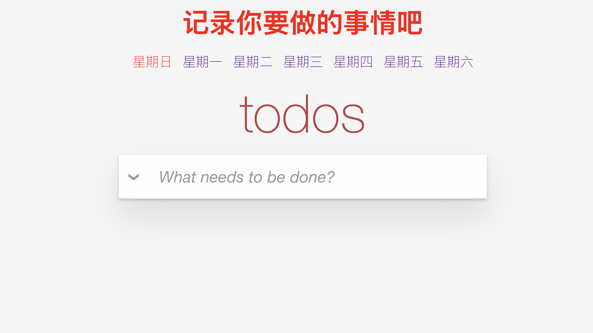

# Vue Todo List 应用

## 📖 项目概述
基于 Vue3 技术栈构建的待办事项管理应用，支持按星期分类管理任务，提供本地存储、路由导航、状态管理等完整功能。



## ✨ 核心特性
- **按星期分类** - 根据星期几划分待办事项
- **数据持久化** - 本地存储支持7天有效期）
- **智能路由**
  - 自动重定向到当前日期路由
  - Hash 模式导航
- **完整Todo功能**
  - 增删改查/状态切换
  - 双击编辑/ESC取消
  - 批量操作/筛选过滤
- **响应式设计** - 适配移动端与PC端

## 🛠️ 技术栈
- **核心框架**: Vue3 Composition API
- **状态管理**: Pinia + 持久化插件
- **路由系统**: Vue Router
- **构建工具**: Vite
- **工具类**
  - 唯一ID生成
  - 增强版LocalStorage

## 🚀 快速启动
```bash
# 克隆仓库
git clone [仓库地址]

# 安装依赖
npm install

# 开发模式
npm run dev

# 生产构建
npm run build

# 本地预览
npm run preview
```

## 📂 项目结构
```bash
src/
├── assets/        	 # 静态资源
├── components/      # 组件库
│   ├── Date.vue     # 星期导航
│   └── TodoList.vue # 核心功能组件
├── store/         	 # Pinia 状态管理
│   └── todo.js    	 # Todo状态逻辑
├── utils/         	 # 工具类
│   ├── SetId.js   	 # ID生成器
│   └── Storage.js 	 # 存储增强
├── views/         	 # 页面视图
│   └── Test.vue   	 # 测试界面
├── router/          # 路由器
│   └── index.js   	 # 路由配置
└── main.js        	 # 应用入口
```

## ⚙️ 配置说明
1. **路由基础路径**  
   修改 `vite.config.js` 中的 `base` 配置（文档13）
   ```js
   base: process.env.VITE_BASE_PUBLIC || '/your-path/'
   ```

2. **存储有效期**  
   调整 `Storage.js` 中的 expiry 值（文档9）
   ```js
   expiry: now.getTime() + 7 * 24 * 60 * 60 * 1000 // 修改7天有效期
   ```

## ⚠️ 注意事项
1. **数据安全**
   - 本地存储数据7天后自动过期
   - 敏感数据建议服务端存储

2. **路由行为**
   - 未匹配路由自动重定向到当前日期
   - 首次加载自动追加 `#/all` hash

3. **兼容性**
   - 推荐使用 Chrome/Firefox 等现代浏览器
   - 不支持 IE 等老旧浏览器

## 📄 开源协议
 [LICENSE](LICENSE) 
